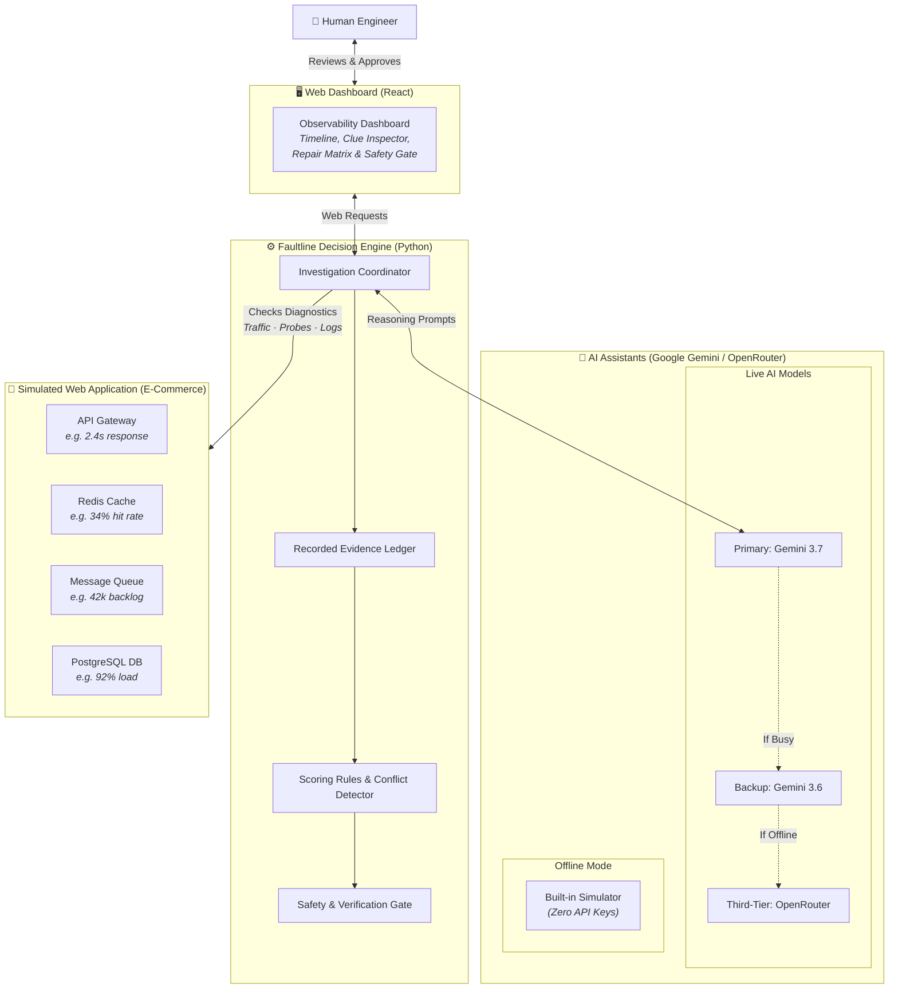
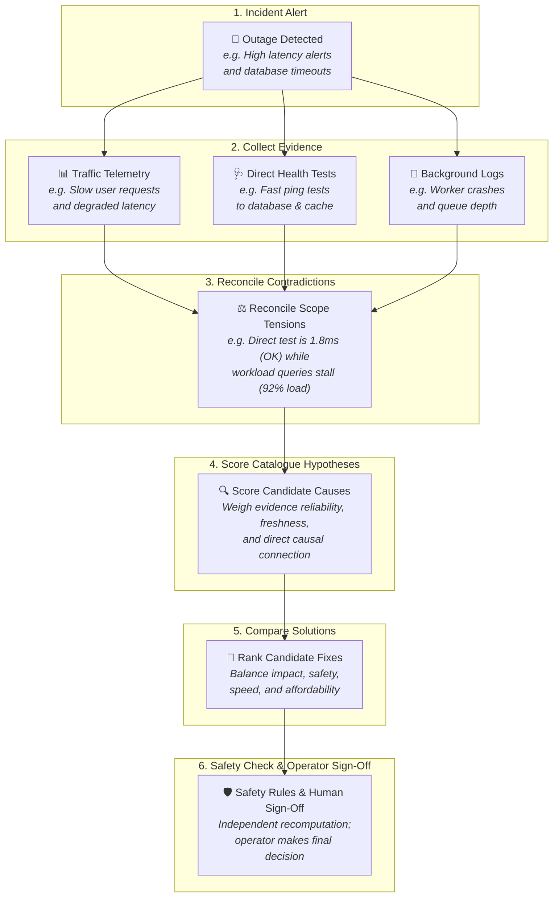
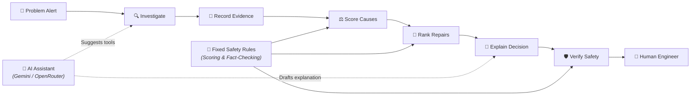

# Faultline — AI-Assisted Detective for Software Outages

> Faultline gathers conflicting clues about why a system broke, ranks the most strongly supported causes, compares possible repairs across impact, safety, speed and cost, and recommends the best trade-off — without executing anything automatically.

[](https://github.com/AnasBabari/LEC_AI/actions/workflows/ci.yml)
[](LICENSE)
[](https://python.org)
[](https://react.dev)

> [!NOTE]
> **Prototype boundary:** Faultline currently investigates simulated distributed-system incidents. Its telemetry, health probes, and operational events come from deterministic fixtures or a procedural incident generator rather than live infrastructure. The decision engine, evidence reconciliation, scoring, validation, model orchestration, and dashboard are fully implemented; live observability integrations are future work.

**Start here:** [What it solves](#what-problem-does-faultline-solve) · [Example investigation](#a-simple-example) · [Three possible repairs](#three-possible-repairs) · [Architecture](#how-faultline-works) · [Run it](#try-it-yourself) · [Inside Faultline](#inside-faultline)

---

## What problem does Faultline solve?

Large web architectures depend on many interconnected components: API gateways, caches, message queues, and relational databases. When an incident occurs, diagnostic streams often provide **conflicting clues**:

- Ingress telemetry reports *"database queries are stalling and connection pools are full."*
- Direct health checks report *"database engine responds in 1.8 ms with healthy CPU."*
- Operational logs report *"an invalidation queue consumer worker crashed 18 minutes ago."*

A human incident responder must determine:
1. Which clues reflect the actual underlying fault versus downstream symptoms?
2. Why do direct synthetic tests disagree with production workload telemetry?
3. What is the most strongly supported root cause?
4. Which remediation action offers the best trade-off between speed, safety, and recovery?

Faultline automates this investigation over simulated diagnostic streams. It gathers observations across independent diagnostic source groups, identifies scope tensions, scores candidate root causes against evidence, compares competing repairs across four weighted dimensions, and recommends the optimal trade-off — leaving execution authority strictly with the human operator.

> **Faultline recommends actions. It never executes them.**
>
> `execution_status = "not_executed"` · `operator_approval_required = True`
>
> It can suggest an operational remediation command, but it cannot execute subprocesses or modify infrastructure. A human operator must review and perform any repair.

---

## A simple example

### The website suddenly becomes slow

A monitoring alert fires: *"API response times are spiking. Database load is elevated."*

Faultline investigates across diagnostic source groups:

1. **Workload Telemetry**: End-to-end response times have risen to 2400 ms. Database connection pool saturation is at 92%. Cache hit ratio has dropped from 92% to 34%. At first glance, the database appears overloaded.
2. **Direct Health Probes**: A direct synthetic health ping to the database responds in 1.8 ms with low CPU. The database engine itself is functional — something upstream is flooding it with unbuffered queries.
3. **Operational Logs**: A background queue consumer worker responsible for processing cache invalidation messages crashed. An unconsumed backlog of 42,000 messages has accumulated.
4. **Causal Chain**: Stale cache entries forced high cache-miss rates, directing traffic straight to the primary database. The database is healthy in isolation, but overwhelmed by upstream invalidation failure.

**Scope tension reconciled:** Direct probes test primary key lookup latency on an idle connection, whereas workload telemetry reflects aggregate throughput under cache miss pressure. Both signals are truthful; their apparent contradiction is explained by the stalled queue consumer.

---

## Three possible repairs

Faultline evaluates candidate remediation strategies from a policy catalogue. For this incident, three primary choices illustrate the trade-off:

| Choice | Why it looks attractive | Operational risk | Rank |
|---|---|---|:---:|
| **Restart worker and drain backlog** | Resolves the root cause of stale cache entries | Backlog requires time to drain | **#1 (Winner)** |
| **Temporarily throttle incoming traffic** | Immediately relieves downstream database pressure | Treats symptom; does not fix consumer | **#2** |
| **Flush and restart the cache** | Fastest execution | Risks 100% cache stampede onto database | **#3** |

**The fastest repair is not the winner.** Faultline ranks the first option highest because it addresses the true root cause with acceptable operational safety.

---

## How Faultline works

### 1. System Overview & Monitored Application

How the **Web Dashboard**, **Decision Engine**, **AI Assistants**, and **Monitored Systems** interact:



> **Key takeaway:** AI assistants suggest diagnostic queries and draft plain-English explanations; deterministic Python computes all scores, verifies evidence, and enforces strict safety boundaries.

---

### 2. Step-by-Step Investigation Flow



> **Key takeaway:** Faultline reconciles contradictory observations and ranks the most strongly supported root-cause hypothesis from a policy-controlled catalogue, then compares candidate repairs by weighing trade-offs before passing through independent safety checks.

---

### 3. Who Does What: Decision & Trust Boundary



---

## Inside Faultline

### AI investigates, Python decides

Faultline pairs LLM reasoning models (Google Gemini with multi-tier OpenRouter fallback) with deterministic Python rule engines:

- **AI model role**: Chooses which diagnostic tools to invoke, suggests candidate hypotheses from the allowed catalogue, and drafts plain-English narrative summaries.
- **Python engine role**: Assigns immutable evidence IDs, verifies observation grounding, enforces source-group caps, computes conflict tensions, calculates mathematical scores, sorts strategy rankings, and executes authoritative recomputation validation.

### Evidence Scoring Formula

An observation's numerical strength is computed deterministically:

$$\text{Evidence Strength} = \text{Reliability} + \text{Freshness} + \text{Directness}$$

| Dimension | Definition | Scale |
| :--- | :--- | :--- |
| **Reliability** | Source authority | Verified (3) · Aggregated (2) · Advisory (1) |
| **Freshness** | Temporal proximity | Current (2) · Recent (1) · Stale (0) |
| **Directness** | Causal proximity | Direct (3) · Indirect (2) · Contextual (1) |

### The Source-Group Cap

To prevent correlated signals from a single monitoring domain from dominating the score, Faultline enforces a **source-group cap**: only the strongest observation from each diagnostic source group (`telemetry`, `health_probe`, `operational_event`) contributes numerically to a hypothesis score. Additional observations remain recorded in the immutable ledger for context.

$$\text{Net Score} = \max(0, \text{Capped Support} - \text{Capped Opposition})$$

### Strategy Ranking Multi-Dimensional Weights

Candidate repairs are evaluated across four weighted dimensions:

$$\text{Final Score} = 0.60 \times \text{Impact} + 0.20 \times \text{Safety} + 0.15 \times \text{Speed} + 0.05 \times \text{Affordability}$$

Impact is weighted highest (60%) to ensure solutions address the root cause, while safety (20%) and speed (15%) ensure operational risk and time-to-relief are balanced.

---

### Independent Recomputation in `ReportValidator`

Faultline does not assume generated reports are correct. Before an investigation result is returned, [`ReportValidator`](file:///c:/Users/Babar/Documents/Coding/Projects/LEC_AI/src/faultline/validation.py) independently reconstructs the authoritative state:

1. **Ledger Reconstruction**: Re-instantiates `EvidenceLedger` from the report, verifying sequential ID continuity and deduplication integrity.
2. **Conflict Recomputation**: Re-evaluates all cross-source scope tensions from scratch.
3. **Hypothesis Scoring**: Re-scores all six root causes in the catalogue using policy rules and source-group caps.
4. **Strategy Ranking**: Recomputes all multi-dimensional scores and unrounded tie-breakers.
5. **Grounding Verification**: Ensures cited evidence IDs, conflict IDs, and component entities match authoritative records.
6. **Execution Boundary**: Confirms `execution_status == "not_executed"` and `operator_approval_required == True`.

If the report's scores, rankings, or safety flags deviate from authoritative recomputation, the entire report is rejected.

---

## HTTP API Endpoints

| Endpoint | Method | Description |
|---|---|---|
| `/health` | `GET` | Service health, version, and model provider configuration status |
| `/api/scenarios` | `GET` | Lists available canonical and dynamically synthesized incident scenarios |
| `/api/incidents/generate` | `POST` | Procedurally synthesizes a dynamic incident across 6 supported archetypes |
| `/api/analyze` | `POST` | Synchronous multi-round investigation returning validated `AnalysisResult` |

---

## Procedural Incident Synthesis

Faultline includes a built-in **Procedural Incident Synthesis Engine** ([`src/faultline/generator.py`](file:///c:/Users/Babar/Documents/Coding/Projects/LEC_AI/src/faultline/generator.py)) that synthesizes realistic incidents on demand with randomized metric variance, scope tensions, and background noise across six operational failure archetypes:

1. **`CACHE_INVALIDATION_CONSUMER_STALLED`** — Worker crash, queue backlog accumulation, stale cache hits, and database pool saturation. Expected Winner: `RECOVER_CONSUMER_AND_DRAIN`.
2. **`DATABASE_INDEX_REGRESSION`** — Dropped index via DDL migration, full table scan surge, healthy point synthetic pings vs degraded workload queries. Expected Winner: `REBUILD_DATABASE_INDEX`.
3. **`FLASH_SALE_SURGE`** — Ingress API Gateway saturation, rate-limiting engagement, downstream connection queuing. Expected Winner: `THROTTLE_TRAFFIC`.
4. **`CACHE_CLUSTER_OUTAGE`** — Redis node termination, sentinel failover, 100% cache stampede onto PostgreSQL. Expected Winner: `RESTART_CACHE`.
5. **`REPLICA_REPLICATION_LAG`** — Primary write burst, replica sync delay, read freshness degradation. Expected Winner: `THROTTLE_TRAFFIC`.
6. **`DATABASE_CAPACITY_DEGRADATION`** — Exclusive lock contention, transaction wait timeouts, connection pool exhaustion. Expected Winner: `THROTTLE_TRAFFIC`.

> **Deterministic Test Oracle:** The generator's expected winner metadata is used as an external test oracle for regression assertions across seeds (`42`, `101`, `777`). It is never passed into the orchestrator or scoring engine during investigation.

---

## Model Provider Architecture

- **Live Tier 1 (Primary)**: `gemini-3.7-flash` via Google GenAI SDK.
- **Live Tier 2 (Gemini Fallback)**: `gemini-3.6-flash` for rate limits (429), capacity errors (503), or timeouts.
- **Live Tier 3 (OpenRouter Fallback)**: `google/gemini-2.0-flash-001` via OpenRouter if Google endpoints are unavailable.
- **Deterministic Offline Mode**: Built-in `FakeGeminiProvider` for hermetic testing and credential-free evaluation.
- **Error Sanitization**: Provider errors returned through the API and recorded in fallback metadata are sanitized to avoid exposing credentials or authorization data.

---

## Try It Yourself

### Prerequisites

- Python 3.11+ (with [`uv`](https://docs.astral.sh/uv/) package manager)
- Node.js 20+ (for the frontend dashboard)
- *(Optional)* `GEMINI_API_KEY` or `OPENROUTER_API_KEY` for live AI reasoning

### Local Setup

```bash
# Clone the repository
git clone https://github.com/AnasBabari/LEC_AI.git
cd LEC_AI

# Install locked dependencies
uv sync --frozen --all-extras

# (Optional) Set API keys for live AI
export GEMINI_API_KEY="your-gemini-key"
export OPENROUTER_API_KEY="your-openrouter-key"

# Run offline CLI analysis
uv run faultline analyze --offline --scenario cache_invalidation_lag

# Start the FastAPI server (serves API and compiled frontend)
uv run uvicorn faultline.app:app --host 0.0.0.0 --port 8000

# (Development) Run frontend dev server
cd frontend && npm ci && npm run dev
# Open http://localhost:5173
```

### Docker

```bash
docker build -t faultline .
docker run -p 8000:8000 faultline
# Open http://localhost:8000
```

### Automated Verification

```bash
# Backend test suite (98 passed, 2 opt-in live tests skipped)
uv run pytest -v

# Static analysis and typing
uv run ruff check src/ tests/
uv run mypy src/ tests/

# Frontend verify and build
cd frontend && npm run verify && npm run build
```

---

## Limits of this Prototype

- Diagnostic sources are deterministic scenario fixtures and procedural generators, not live Prometheus or database connections.
- Remediation commands are illustrative strings and are never executed by the system.
- Scoring formulas and strategy weights are explicit policy definitions, not machine-learned probabilities.
- Structured assertions are validated by independent recomputation, but a human operator must review the written narrative and approve any real-world infrastructure change.

---

## AI Assistance Disclosure

AI tools, including Gemini 3.7 Flash via Antigravity, assisted with planning, implementation, code review, debugging, testing, and iteration. All shipped architecture, deterministic scoring policies, evidence-validation boundaries, and safety constraints were reviewed and verified, and can be defended in detail.

---

## Links

- **Repository:** [github.com/AnasBabari/LEC_AI](https://github.com/AnasBabari/LEC_AI)
- **Dashboard:** `http://localhost:5173` (local dev) or `http://localhost:8000` (Docker / static)
- **Reference Output:** [`examples/canonical-report.offline.json`](examples/canonical-report.offline.json)
