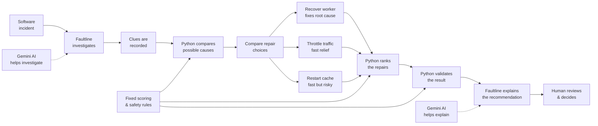

# Faultline — AI-Assisted Detective for Software Outages

> Faultline gathers conflicting clues about why a system broke, works out what probably went wrong, compares several possible repairs with different trade-offs, and ranks the safest one — without executing anything automatically.

[](https://github.com/AnasBabari/LEC_AI/actions/workflows/ci.yml)
[](LICENSE)
[](https://python.org)
[](https://react.dev)

**Start here:** [What it solves](#what-problem-does-faultline-solve) · [Example investigation](#a-simple-example) · [Three possible repairs](#three-possible-repairs) · [Architecture](#how-faultline-works) · [Run it](#try-it-yourself) · [Inside Faultline](#inside-faultline)

---

## What problem does Faultline solve?

Large websites depend on many parts working together: databases, caches, message queues, gateways. When something goes wrong, monitoring tools often give **conflicting clues**.

One tool might say *"the database is overloaded."*
Another might say *"the database is perfectly healthy."*
A third might report *"a background worker has stopped."*

A human engineer now has to decide:

- Which clues matter?
- Which clues disagree, and why?
- What actually caused the problem?
- Which of several possible repairs is safest to try first?

Faultline automates the investigation. It collects clues from independent sources, identifies where they conflict, scores possible causes against the evidence, compares competing repairs with different trade-offs, and ranks them — then hands everything to a human operator to decide what to do.

> **Faultline recommends actions. It never executes them.**
>
> It can say *"restart this worker first,"* but it cannot press the button itself. A human must approve and perform any repair.

---

## A simple example

### The website suddenly becomes slow

A monitoring alert fires: *"API response times are spiking. The database looks overwhelmed."*

Faultline investigates.

**Clue 1 — The symptoms.**
Website response times have jumped to 2400 ms. The database is handling a huge number of connections (92% of its capacity). The *cache* — a small shelf of frequently used information that lets the system answer common requests quickly — has dropped from 92% useful to just 34%.

At first, the database looks guilty.

**Clue 2 — A direct health check.**
Faultline sends a direct test query to the database. It responds in 1.8 ms with low CPU usage.

So the database engine itself is not broken. Something else is flooding it with work.

**Clue 3 — The real culprit.**
A *background worker* — a small program that quietly handles jobs behind the scenes — was responsible for keeping the cache up to date. It crashed 18 minutes ago. Since then, 42,000 pending update messages have piled up.

**Clue 4 — The chain reaction.**
Because the cache is stale, thousands of requests that would normally be answered instantly are being sent straight to the database instead. The database is healthy but overwhelmed by upstream failure.

**The clues appear to disagree — but both are true.**
The database can be healthy when tested directly while still being overwhelmed by thousands of real user requests. Faultline calls this kind of situation a *"scope tension"*: two measurements that seem contradictory because they are looking at different angles of the same component.

---

## Three possible repairs

Faultline now has to choose between several plausible actions. Three stand out:

| Choice | Why it looks attractive | Main problem | Result |
|---|---|---|---|
| **Restart the failed cache worker and drain its backlog** | Fixes the source of the stale cache | The backlog takes time to clear | **#1** |
| **Temporarily slow down incoming traffic** | Quickly reduces pressure on the database and surrounding system | Treats the symptom rather than repairing the failed worker | **#2** |
| **Flush and restart the cache** | Fastest action | Could create a cache stampede and worsen database load | **#3** |

**The fastest repair is not the winner.** Faultline chooses the first option because it addresses the root cause while keeping operational risk acceptable.

This is the central challenge Faultline is designed around: the most obvious repair is not always the best one. Restarting the cache is faster, and throttling traffic reduces pressure quickly, but recovering the failed worker is ranked first because it fixes the underlying cause with lower downstream risk.

Faultline evaluates a full repair catalogue — `RECOVER_CONSUMER_AND_DRAIN`, `THROTTLE_TRAFFIC`, `RESTART_CACHE`, `REBUILD_DATABASE_INDEX`, `FAILOVER_DATABASE`. These three choices illustrate the most important trade-off in the main scenario.

---

## How Faultline works



The solid arrows show the trusted decision path: investigate, record evidence, compare possible causes, **compare several competing repairs**, rank them by their trade-offs, validate the result, and explain it to a human — who makes the final decision. Gemini assists with investigation and explanation (dotted arrows), while deterministic Python owns evidence recording, conflict detection, scoring, ranking, and validation, guided by fixed scoring and safety rules. The process stops at a human operator — Faultline never executes a repair automatically.

> The diagram highlights three representative choices from the canonical incident. Faultline evaluates the full repair catalogue before producing its ranking.

---

## Inside Faultline

### AI investigates, Python decides

Faultline pairs Gemini AI with deterministic Python code, with clearly separated jobs.

Gemini helps decide:

- which diagnostics to inspect;
- which allowed root causes are worth investigating;
- how to explain the result to a human.

Python owns:

- evidence IDs;
- whether evidence actually exists;
- whether evidence actually supports a cause;
- conflict classification;
- numeric scores;
- strategy ranking;
- safety checks;
- final validation.

> Gemini assists with reasoning, but deterministic Python owns decision authority.

Here, *deterministic* simply means that the same evidence and the same fixed rules produce the same numerical result. Every run over the same data produces identical scores and rankings.

### How clues are scored

A clue becomes stronger when it is:

- trustworthy;
- recent;
- directly related to the suspected problem.

```text
Evidence Strength =
Reliability + Freshness + Directness
```

| Part | What it measures | Values |
| :--- | :--- | :--- |
| **Reliability** | How trustworthy the source is | Verified (3) · Aggregated (2) · Advisory (1) |
| **Freshness** | How close in time to the incident | Current (2) · Recent (1) · Stale (0) |
| **Directness** | How directly it connects to the cause | Direct (3) · Indirect (2) · Contextual (1) |

### The source-group cap

Ten measurements produced by the same monitoring system should not automatically count like ten independent opinions. Ten people repeating the same rumour are not the same as ten independent witnesses.

Faultline therefore limits how much evidence from the same source group can contribute to the numerical score — the `source-group cap`. Additional correlated measurements are still recorded as clues, but they cannot inflate a cause's score.

### Support vs opposition

```text
Net Evidence =
max(0, Support - Opposition)
```

Evidence supporting a cause increases its score. Evidence contradicting that cause reduces it. If the opposition becomes stronger than the support, Faultline treats that cause as having zero usable evidence rather than a negative score.

### Decision weights

Decision weights are policy-derived ratios, not probabilities. In the canonical incident, 73.7% of the positive policy-weighted evidence points toward the stalled cache-invalidation worker. That describes how the evidence is split between candidate causes — it is not a claim that the cause is "73.7% likely" to be right.

### How repairs are ranked

Each repair is judged on four questions:

1. Will it solve the real problem? *(Impact)*
2. Is it safe? *(Safety)*
3. How quickly can it help? *(Speed)*
4. How expensive or difficult is it? *(Cost)*

| Factor | Weight |
| :--- | ---: |
| Impact | 60% |
| Safety | 20% |
| Speed | 15% |
| Cost | 5% |

Impact receives the largest weight because a very fast repair for the wrong problem is still the wrong repair.

### Why the canonical ranking lands as it does

**Restart the failed cache worker and drain its backlog — #1.** It wins because it addresses the root cause, is backed by strong evidence for a stalled consumer, avoids destructive cache behaviour, and carries reasonable operational safety.

**Temporarily slow down incoming traffic — #2.** It is useful because it reduces immediate system pressure, is relatively safe, and fairly fast. It loses because it does not repair the stalled worker, and the workload returns once throttling is removed.

**Flush and restart the cache — #3.** It is attractive because it is the fastest option. It loses because it does not repair the consumer, it discards useful cached data, and an empty cache can send a request stampede against an already-strained database.

### Report validation

Faultline does not trust its own generated report simply because the pipeline produced it. Before returning an answer, Python checks again:

- evidence references;
- cause scores;
- repair calculations;
- ranking order;
- safety flags.

If the structured result disagrees with the fixed rules, the report is rejected. This gate lives in `ReportValidator` (`src/faultline/validation.py`).

### Model setup

Primary: `gemini-3.7-flash` · Fallback: `gemini-3.6-flash`.

If the preferred Gemini model becomes unavailable, Faultline can use the fallback for that investigation without changing the model state of other investigations.

Offline mode replaces Gemini with deterministic test behaviour, so the full pipeline can run in CI without credentials.

### Testing

```bash
uv run pytest -v
uv run ruff check src/ tests/
uv run mypy src/ tests/
cd frontend && npm run verify
docker build -t faultline .
```

GitHub Actions runs the verification suite automatically on pushes to `main`.

---

## Safety

Faultline's most important safety rule is simple:

> **It never executes repairs.**
>
> `execution_status = "not_executed"` · `operator_approval_required = True`

Suggested commands (like `kubectl rollout restart ...`) are display-only illustrations. There is no code in Faultline that runs shell commands, calls subprocess, or executes repairs. A human operator must review the recommendation and act on it independently.

---

## What you can see in the dashboard

Faultline includes a React web dashboard that shows:

- the initial incident alert;
- a step-by-step investigation timeline;
- all collected evidence with source, status, and values;
- conflicting clues and how they are resolved;
- scored root-cause hypotheses;
- ranked repair strategies with scores;
- a written explanation defending the recommendation;
- operator safety status.

---

## Try it yourself

### Prerequisites

- Python 3.11+ (with [`uv`](https://docs.astral.sh/uv/) package manager)
- Node.js 20+ (for the frontend dashboard)
- *(Optional)* `GEMINI_API_KEY` for live AI reasoning — runs fully deterministic in offline mode without a key

### Local setup

```bash
# Clone the repository
git clone https://github.com/AnasBabari/LEC_AI.git
cd LEC_AI

# Install locked Python dependencies
uv sync --frozen --all-extras

# Run an offline analysis from the command line
uv run faultline analyze --offline --scenario cache_invalidation_lag

# Start the backend API server
uv run uvicorn faultline.app:app --host 0.0.0.0 --port 8000

# In a separate terminal, start the React frontend
cd frontend && npm ci && npm run dev
# Open http://localhost:5173
```

### Docker

```bash
docker build -t faultline .
docker run -p 8000:8000 -e GEMINI_API_KEY="your-key-optional" faultline
# Open http://localhost:8000
```

---

## Limits of this demo

Faultline is a working decision-support prototype, not a production control plane.

- Diagnostic sources are deterministic scenario simulators, not live Prometheus, database, cache, or queue integrations.
- Repair commands are illustrative strings. They are never executed.
- Evidence and strategy weights are explicit policy choices, not learned probabilities or guarantees of recovery.
- Gemini is optional. Offline mode makes the full workflow reproducible for assessment and CI.
- Structured claims are checked, but a human operator must still review the written explanation and approve any real-world action.

These boundaries are deliberate: the assessment focuses on reasoning through conflicting diagnostics and defending a repair ranking.

---

## Scenarios

Faultline includes two tested scenarios:

- **`cache_invalidation_lag`** — The canonical incident described above. Winner: `RECOVER_CONSUMER_AND_DRAIN` (restart the failed cache worker and drain its backlog).
- **`index_regression`** — A software update accidentally removes a database index — a structure that helps the database find information quickly. The database itself remains healthy, but real application queries become much slower. Faultline recommends rebuilding the missing index: `REBUILD_DATABASE_INDEX`.

### What I would build next

- Dynamic scenario generator using synthetic chaos engineering faults.
- Automated post-mortem exporter to Markdown or GitHub Issues.
- Direct Prometheus / OpenTelemetry OTLP telemetry ingestion.

---

## AI assistance disclosure

AI tools, including Gemini 3.7 Flash High via Antigravity, assisted with planning, implementation, code review, debugging, testing, and iteration. I reviewed and tested the shipped architecture, deterministic scoring policy, evidence-validation boundaries, and safety constraints, and can explain and defend the resulting implementation and its trade-offs.

---

## Links

- **Repository:** [github.com/AnasBabari/LEC_AI](https://github.com/AnasBabari/LEC_AI)
- **Dashboard:** `http://localhost:5173` (local) or `http://localhost:8000` (Docker)
- **Reference output:** [`examples/canonical-report.offline.json`](examples/canonical-report.offline.json)
