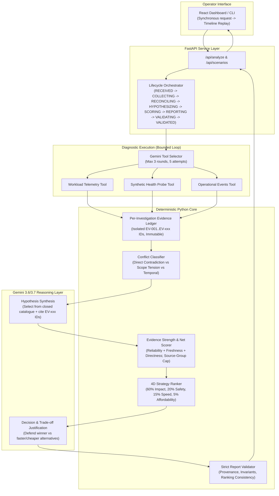

# Faultline — Operational Incident Decision-Support Agent

> **Rank competing repair strategies when diagnostics conflict.**  
> Built for the LEC AI Engineering Intern assessment.

[](https://github.com/AnasBabari/LEC_AI/actions/workflows/ci.yml)
[](LICENSE)
[](https://python.org)
[](https://fastapi.tiangolo.com)
[](https://react.dev)

---

## 1. Executive Summary & Architecture

Modern distributed systems rarely fail with single, unambiguous alarms. During major incidents, monitoring tools frequently present **contradictory signals**:
- **Application workload telemetry** reports high database latency and connection pool exhaustion.
- **Synthetic health probes** report the database engine is responding normally in 1.8ms.
- **Message queue logs** reveal that a background cache-invalidation consumer crashed 18 minutes ago, creating a 42,000-message backlog and flooding the database with stale cache misses.

The fastest or loudest fix (e.g. flushing the cache or failing over the database) is often disastrous: flushing the cache causes an immediate 100% cache stampede onto the strained database, while database failover risks replication data loss without fixing the stalled invalidation worker.

**Faultline** solves this through a **hybrid agent architecture**:
- **LLM Reasoning (Gemini 3.7 Flash Primary, Gemini 3.6 Flash Fallback)**: Gemini 3.7 Flash is the intended primary model with exact accessible API model IDs verified at startup via `client.models.list()`, and Gemini 3.6 Flash acting as the automatic verified fallback. The LLM adaptively selects which diagnostic tools to query, synthesizes candidate root causes from an allowed closed catalogue, and drafts written executive justifications defending trade-offs.
- **Deterministic Python Core**: Enforces per-investigation evidence provenance (`EV-001`, `EV-002`, ...), deterministically classifies conflicts (*Direct Contradictions* vs. *Scope Tensions* vs. *Temporal Conflicts*), scores net evidence strength with per-source-group caps, calculates 4-dimensional strategy scores, and strictly validates all invariants before presenting recommendations to human operators.



---

## 2. Canonical Incident Walkthrough (`cache_invalidation_lag`)

### Initial Fault Alert
- **Alert**: Spiking API Gateway p99 response times (2400ms) & database connection pool saturation (92%).
- **Loudest Symptom**: Database appears overwhelmed.

### Multi-Source Diagnostic Investigation
1. **Telemetry (`query_telemetry`)**:
   - `[EV-001]` API Gateway p99 latency: 2400ms (`degraded`)
   - `[EV-002]` Database connection pool saturation: 92% (`degraded`)
   - `[EV-003]` Cache hit ratio collapsed from 92% to 34.2% (`degraded`)
2. **Health Probes (`run_health_probes`)**:
   - `[EV-004]` Database synthetic direct probe (SELECT 1 & indexed query): 1.8ms, CPU 18% (`healthy`)
   - `[EV-005]` Cache cluster TCP ping: 0.5ms (`healthy`)
   - `[EV-006]` Gateway health endpoint: HTTP 200 in 2.1ms (`healthy`)
3. **Operational Events (`fetch_operational_events`)**:
   - `[EV-007]` Message queue invalidation consumer heartbeat lost at $T - 18\text{m}$ (OOM crash) (`failed`)
   - `[EV-008]` Invalidation queue backlog: 42,850 accumulated messages (`failed`)
   - `[EV-009]` Cache stale mutation divergence: 28,400 stale keys (`degraded`)

### Conflict Classification: Scope Tension vs Direct Contradiction
- **The Conflict**: `[EV-002]` (DB Workload connection saturation) vs `[EV-004]` (DB Synthetic probe).
- **Classification**: `SCOPE_TENSION`.
- **Operational Insight**: Both monitoring systems are telling the truth within their respective measurement scopes. Direct synthetic queries respond in 1.8ms with low CPU, proving the database engine is healthy. However, the database is saturated under workload because the stalled invalidation worker caused a 65.8% cache miss cascade directly to the database tier.

---

## 3. Evidence Scoring & 4D Strategy Ranking Algorithms

### Evidence-Strength Scoring
Each observation contributes to a candidate cause based on:
$$\text{Observation Strength} = \text{Reliability} + \text{Freshness} + \text{Directness}$$
- **Reliability**: Verified direct probe / kernel event ($+3$), Aggregated metric ($+2$), Advisory log ($+1$).
- **Freshness (relative to incident time)**: Current $\le 5\text{m}$ ($+2$), Recent $\le 30\text{m}$ ($+1$), Stale ($0$).
- **Directness**: Direct causal indicator ($+3$), Indirect symptom ($+2$), Contextual ($+1$).

#### Per-Source-Group Cap (Anti-Correlation Guard)
To prevent 10 correlated telemetry metrics from numerically drowning out an independent health probe, **only the strongest supporting and strongest opposing observation per source group contributes numerically**. Additional metrics corroborate visually but do not inflate score totals.

$$\text{Net Evidence} = \max(0, \text{Support} - \text{Opposition})$$
$$\text{Policy Decision Weight} = \frac{\text{Net Evidence}}{\sum \text{Positive Net Evidence}} \times 100 \quad \text{(*Policy-derived weight, not an empirical probability)}$$

#### Evaluated Causes for Canonical Incident
| Cause Code | Supporting Observations | Opposing Observations | Net Score | Decision Weight | Strength Band |
| :--- | :--- | :--- | :---: | :---: | :---: |
| `CACHE_INVALIDATION_CONSUMER_STALLED` | Telemetry (+6), Events (+8) | None (0) | **14.0** | **73.7%** | **STRONG** |
| `TRAFFIC_SURGE` | Telemetry (+5) | None (0) | **5.0** | **26.3%** | **WEAK** |
| `DATABASE_CAPACITY_DEGRADATION` | Telemetry (+6) | Health Probe (-8) | **0.0** | **0.0%** | **UNSUPPORTED** |
| `CACHE_NODE_FAILURE` | None (0) | Health Probe (-8) | **0.0** | **0.0%** | **UNSUPPORTED** |

---

### 4-Dimensional Strategy Ranking
$$\text{Final Score} = 0.60 \times \text{Expected Impact} + 0.20 \times \text{Safety} + 0.15 \times \text{Speed} + 0.05 \times \text{Affordability}$$

| Rank | Strategy ID | Strategy Name | Impact (60%) | Safety (20%) | Speed (15%) | Cost (5%) | Final Score | Suggested Action Command |
| :---: | :--- | :--- | :---: | :---: | :---: | :---: | :---: | :--- |
| **#1** | `RECOVER_CONSUMER_AND_DRAIN` | Restart Invalidation Consumer & Drain Backlog | **73.7** | **75.0** | 50.0 | 75.0 | **70.47** | `kubectl rollout restart deployment/cache-invalidation-worker -n services && redis-cli info` |
| **#2** | `THROTTLE_TRAFFIC` | Apply API Gateway Rate Limiting & Load Shedding | 63.2 | 75.0 | 75.0 | 75.0 | **67.89** | `kubectl patch ingress/api-gateway -n ingress --type merge -p '{"spec":{"rateLimit":{"requestsPerSecond":500}}}'` |
| **#3** | `RESTART_CACHE` | Flush & Restart Cache Cluster | 18.4 | 25.0 | **100.0** | **100.0** | **36.05** | `redis-cli flushall && systemctl restart redis-server` |
| **#4** | `REBUILD_DATABASE_INDEX` | Rebuild Missing Database Index Concurrently | 0.0 | 75.0 | 50.0 | 75.0 | **26.25** | `psql -c "CREATE INDEX CONCURRENTLY idx_orders_customer_created ON orders (customer_id, created_at);"` |
| **#5** | `FAILOVER_DATABASE` | Trigger Database Replica Failover | 0.0 | 25.0 | 50.0 | 25.0 | **13.75** | `patronictl failover main-db-cluster --candidate db-replica-01 --force` |

### Defensible Written Trade-Off Justification
- **Why #1 beats #3 (`RESTART_CACHE`)**: Although flushing the cache is the fastest (Speed: 100) and cheapest (Cost: 100) option, it ranks #3 because it leaves the stalled consumer untouched and triggers a catastrophic 100% cache stampede onto an already saturated database.
- **Why #1 beats #5 (`FAILOVER_DATABASE`)**: Database failover fails to address the root cause, incurs DNS transition downtime, and risks data loss.
- **Winner**: `RECOVER_CONSUMER_AND_DRAIN` directly addresses the root cause with high safety and complete reversibility.

---

## 4. Defending Key Engineering Decisions

1. **Why is Faultline an agent?**  
   Diagnostic investigation is not a hard-coded sequence. The agent adaptively decides what tool to query next based on interim observations.
2. **Why does Python control scoring, ranking, and validation?**  
   Safety-critical decisions in operations must be repeatable, testable, and auditable. Python guarantees deterministic mathematical scoring and strict invariant validation.
3. **Why one agent instead of multi-agent orchestration?**  
   Incident investigation requires one accountable decision-maker. Multiple agents introduce coordination latency, state synchronization overhead, and nondeterministic drift.
4. **Why no RAG / vector databases?**  
   Incident diagnostics are ephemeral runtime observations. Embedding static docs does not solve dynamic root-cause isolation.
5. **Why an immutable, per-investigation Evidence Ledger?**  
   Assigns stable sequential IDs (`EV-001`, `EV-002`, ...) fresh per run, preventing hallucinations and cross-run ID pollution.
6. **Why distinguish Scope Tension from Direct Contradiction?**  
   A synthetic probe executing a `SELECT 1` in 1.8ms and an application workload experiencing 185ms queries are both accurate within their respective measurement scopes.
7. **Why cap evidence by source group?**  
   Correlated metrics (e.g. 10 latency histograms) must not overpower independent probes merely through sheer volume.
8. **Why four scoring dimensions (Impact, Safety, Speed, Cost)?**  
   Expected Impact dominates (60%) because a fast fix for the wrong cause is useless. Safety comes second (20%) because remediation must not worsen the outage.
9. **Why synchronous API + client-side timeline replay instead of streaming (SSE)?**  
   Synchronous `POST /api/analyze` is deadline-safe and robust, avoiding SSE reconnect issues and partial parsing bugs while preserving complete timeline playback.
10. **Why verify models at startup with 3.7 primary and 3.6 fallback?**  
    Gemini 3.7 Flash is the intended primary reasoning model. Because API account model availability can vary during rollout, Faultline queries `client.models.list()` once at startup to discover the exact accessible 3.7 identifier without guessing pricing anchors, seamlessly falling back to `gemini-3.6-flash` if unavailable. Probing once at startup caches availability cleanly without per-request latency.
11. **Why medium thinking level?**  
    `thinking_level="medium"` provides the optimal balance of reasoning depth and low latency for live operational decision support.
12. **Why anchor freshness to incident timestamp?**  
    Anchoring to `scenario.incident_at` guarantees 100% reproducible tests today, next week, or next year.
13. **Why explicit operator approval?**  
    `operator_approval_required=True` and `execution_status="not_executed"` ensure no unverified automated mutations occur.

---

## 5. Quickstart & Installation

### Prerequisites
- Python 3.11+ (or `uv`)
- Node.js 20+ (for frontend dashboard)
- (Optional) `GEMINI_API_KEY` for live LLM reasoning (runs fully deterministic without an API key).

### Option A: Local Python & React Setup
```bash
# 1. Clone the repository
git clone https://github.com/AnasBabari/LEC_AI.git
cd LEC_AI

# 2. Set up Python virtual environment with uv
uv venv .venv
# On Windows:
.venv\Scripts\activate
# On Linux/macOS:
source .venv/bin/activate

uv pip install -e ".[dev]"

# 3. (Optional) Configure Gemini API key
cp .env.example .env
# Edit .env and set GEMINI_API_KEY=...

# 4. Run CLI analysis directly
python -m faultline.cli analyze --scenario cache_invalidation_lag

# 5. Start Backend API Server
uvicorn faultline.app:app --host 0.0.0.0 --port 8000

# 6. In a separate terminal, start React Frontend
cd frontend
npm install
npm run dev
# Open http://localhost:5173 in browser
```

### Option B: Docker Container
```bash
# Build unified multi-stage Docker container
docker build -t faultline .

# Run container (frontend + backend unified on port 8000)
docker run -p 8000:8000 -e GEMINI_API_KEY="your-api-key-optional" faultline

# Open http://localhost:8000 in your browser
```

---

## 6. Testing & Quality Verification

```bash
# Run all unit and integration tests (32 tests, 100% passing)
pytest tests/ -v

# Run linting check
ruff check src/ tests/

# Run static type checking
mypy src/ tests/

# Run frontend typechecking and linting
cd frontend && npm run test:run

# Build production frontend bundle
cd frontend && npm run build
```

---

## 7. Secondary Scenario & Extensions

Faultline includes secondary validation scenarios out-of-the-box:
- **`data/scenarios/index_regression.json`**: Database synthetic ping responds healthy (<2ms), but query workload experiences heavy table scans following an unindexed schema migration. Faultline deterministically ranks `REBUILD_DATABASE_INDEX` as the #1 repair strategy over traffic throttling.
- **Dynamic Scenario Injection**: Real-time chaos engineering simulator generating synthetic network partitions, memory leaks, and replica lag.
- **Post-Mortem Auto-Generation**: Automated markdown incident post-mortems exported to incident response repositories.

---

## 8. AI Assistance Disclosure

In accordance with LEC AI's guidelines, modern AI developer tooling (Gemini 3.7 Flash High via Antigravity) was utilized to assist in scaffolding boilerplate, drafting Pydantic schemas, and accelerating UI styling. All architectural decisions, mathematical scoring algorithms, invariant validations, and safety boundaries were designed, reviewed, and defended by the author.

---

## 9. Demonstration & Repository Links

- **Repository**: [https://github.com/AnasBabari/LEC_AI](https://github.com/AnasBabari/LEC_AI) *(Public)*
- **Interactive UI Dashboard**: Available locally at `http://localhost:5173` or in Docker at `http://localhost:8000`.
- **Reference Analysis Output**: Available at [`examples/canonical-report.json`](examples/canonical-report.json).
